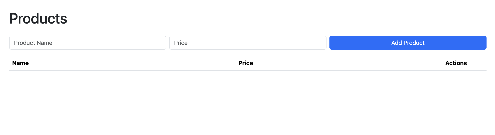

# azure-static-web-app

[](https://github.com/atrakic/azure-static-web-app/actions/workflows/ci.yml)


This is a demonstration & sample application designed to be a full-stack web app (API + frontend but using no front-end frameworks).  
It provides persistent web access to a simple product inventory.

It is built on several Azure technologies, including: _Functions, Static Web Apps_ and _CosmosDB_ .

---



## Deployment Instructions

### 1. Provision Infrastructure (Azure)

The infrastructure is defined in `infra/main.bicep` and can be deployed using the provided Makefile:

```sh
cd infra
make
# This will create a resource group, Cosmos DB account, database, container, and a Static Web App.
```

You can check deployment status and outputs:

```sh
make status
make outputs
```

To clean up Azure resources:

```sh
make clean
```

### 2. Deploy the Application

1. Add Github secret: `AZURE_STATIC_WEB_APPS_API_TOKEN`
2. Manually trigger pipeline `Azure Static Web Apps CI/CD` or push some code to the repository connected to Azure Static Web Apps. As last option use Azure Portal to link your repo and trigger deployment. The Static Web App will be built and deployed automatically.

### 3. Seed the Database (Cosmos DB)

Use the Jupyter notebook in the `notebook/` folder to seed sample data into Cosmos DB:

1. Build and run the notebook container:
   ```sh
   cd notebook
   docker compose up
   # Or run Jupyter Lab locally
   python3 -m pip install jupyterlab
   jupyter lab
   ```
2. Open `cosmicsworks.ipynb` in Jupyter Lab.
3. Follow the notebook steps to:
   - Authenticate to Azure
   - Create Cosmos DB resources (if not already created)
   - Configure Spark/Cosmos connection
   - Create database and containers
   - Ingest sample product data
   - Query and validate data

---

## Notes

- The API [src/shared/context.js](src/shared/context.js) expects Cosmos DB endpoint and credentials to be set in environment variables (see Bicep outputs and Static Web App settings).
- The notebook can be used for both initial seeding and further data exploration.
- For more details, see the documentation in the [notebook/README.md](notebook/README.md).
